# 💬 Nexa Whispers

### **Speak Freely. Stay Private.**

<p align="center">
  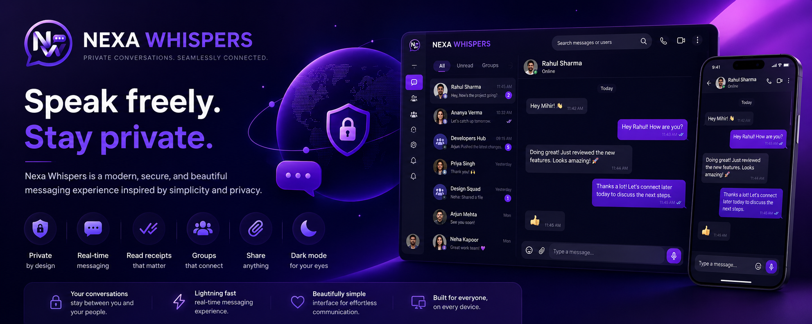
</p>

<p align="center">
  <strong>A modern, privacy-focused, real-time messaging platform built for seamless communication.</strong>
</p>

<p align="center">
  <a href="https://nexa-whispers.vercel.app/">🚀 Live Application</a>
  &nbsp; • &nbsp;
  <a href="https://github.com/mihirgupta665/NEXA-WHISPERS">💻 GitHub Repository</a>
</p>

<p align="center">
  
  
  
  
  
</p>

---

## 🌌 About

**Nexa Whispers** is a full-stack, real-time messaging application focused on **privacy, seamless communication, and a polished user experience**.

The platform combines a modern **React + Vite SPA**, a structured **Node.js + Express REST API**, and an event-driven **Socket.IO** layer backed by persistent **SQLite/Turso** storage.

It provides the complete experience expected from a modern messaging platform — from authentication and conversations to real-time messaging, group management, disappearing messages, contact controls, and responsive UI.

> **Privacy-first UX. Real-time communication. Clean architecture.**

---

## 🎥 Preview

<p align="center">
  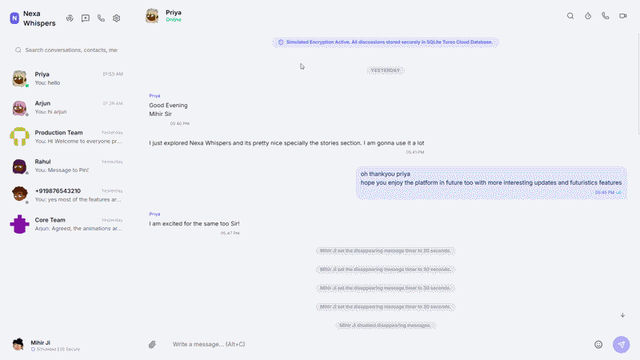
</p>

### 🎬 Full Walkthrough

A complete application walkthrough is available in:

**[`assets/Video.mp4`](assets/Video.mp4)**

---

# 🖼️ Application Gallery

<p align="center">
  <strong>A visual tour of the Nexa Whispers experience.</strong>
</p>

<table>
<tr>
<td width="50%" align="center">

### 🏠 Landing Page

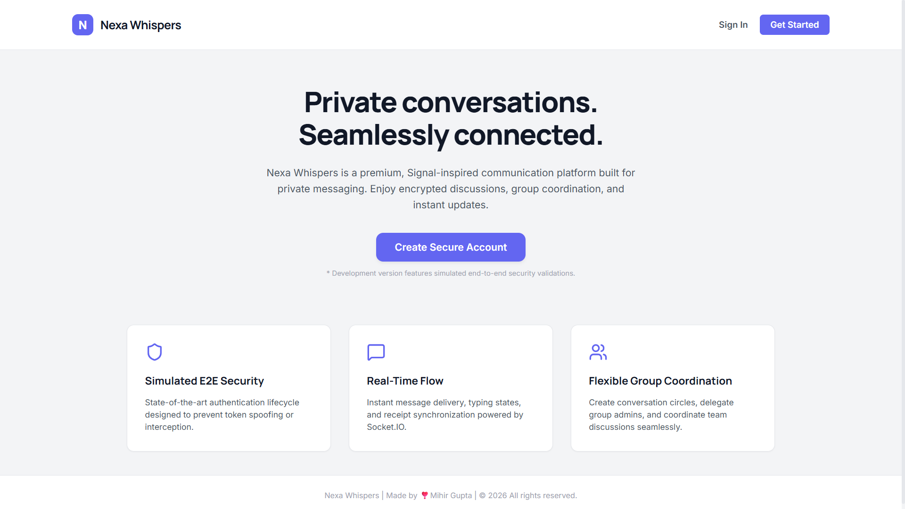

</td>
<td width="50%" align="center">

### 📝 Sign Up Page

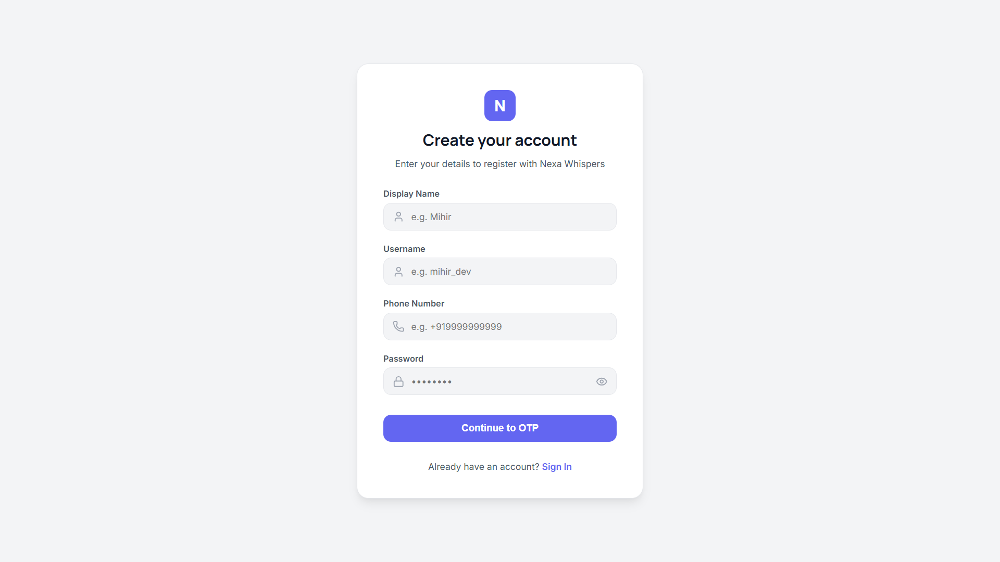

</td>
</tr>

<tr>
<td width="50%" align="center">

### 🔢 OTP Verification

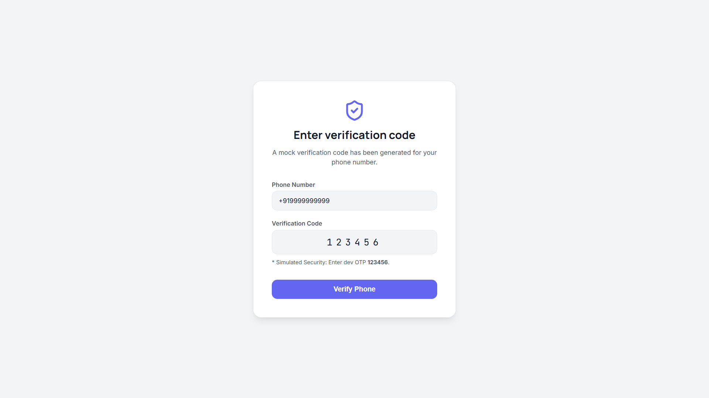

</td>
<td width="50%" align="center">

### 💬 Conversation Page

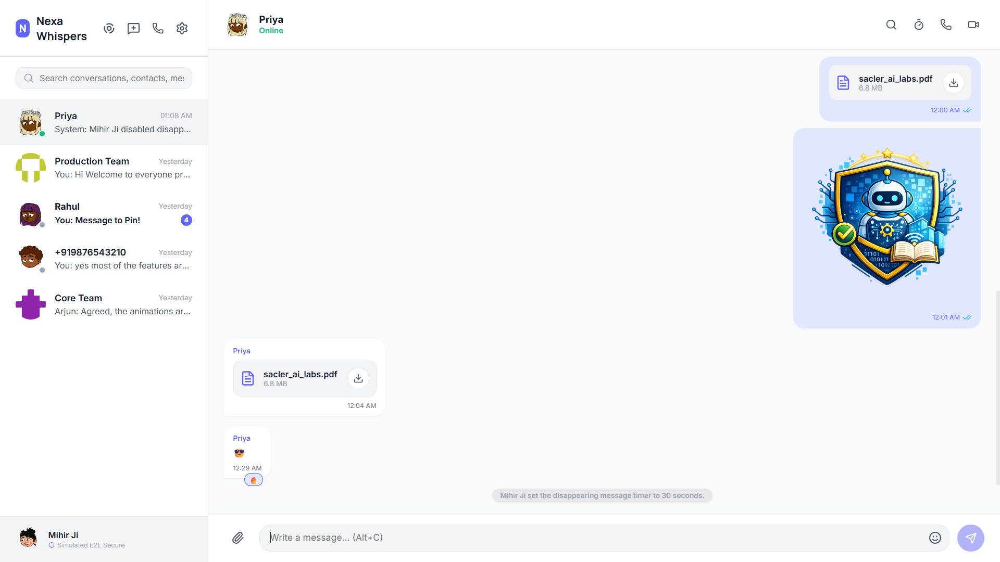

</td>
</tr>

<tr>
<td width="50%" align="center">

### 👤 Contact Information

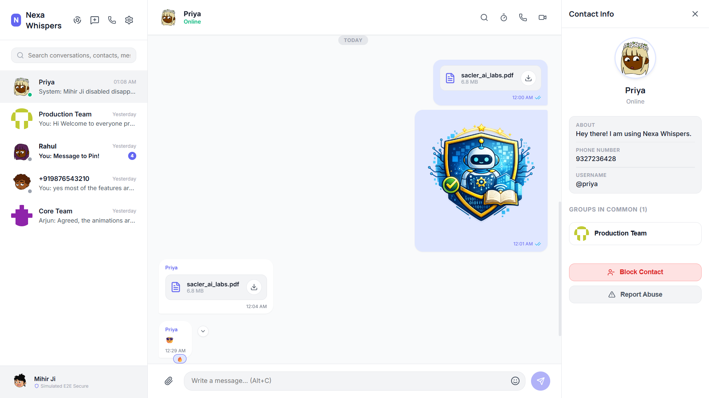

</td>
<td width="50%" align="center">

### ⏱️ Disappearing Message Timer

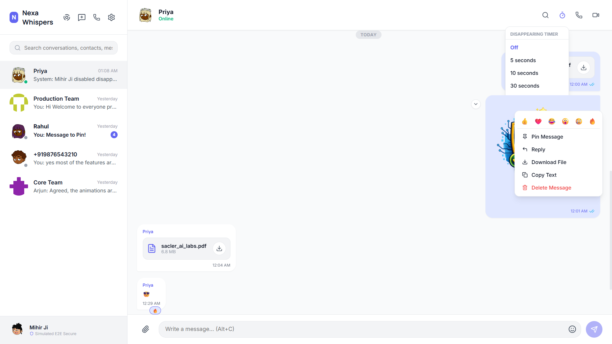

</td>
</tr>

<tr>
<td width="50%" align="center">

### 📖 Stories Section

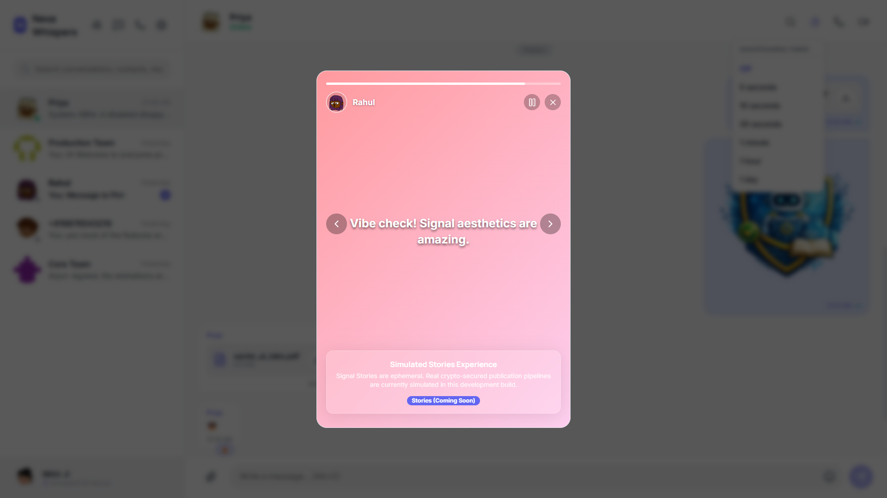

</td>
<td width="50%" align="center">

### ➕ Add Contacts

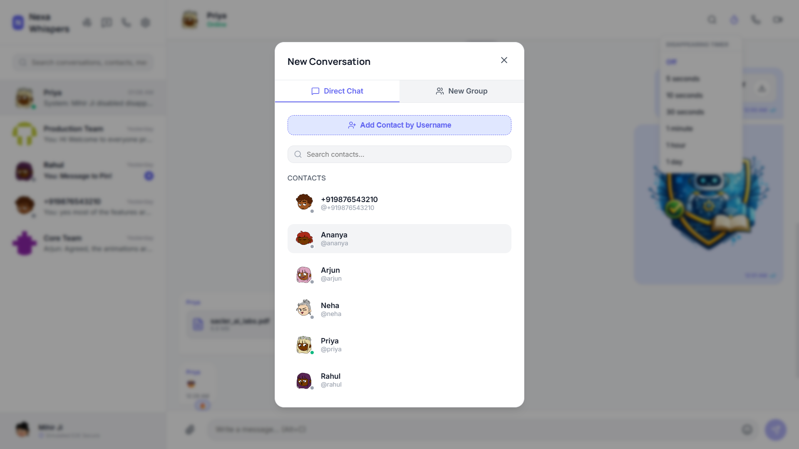

</td>
</tr>

<tr>
<td width="50%" align="center">

### 👥 New Group Creation

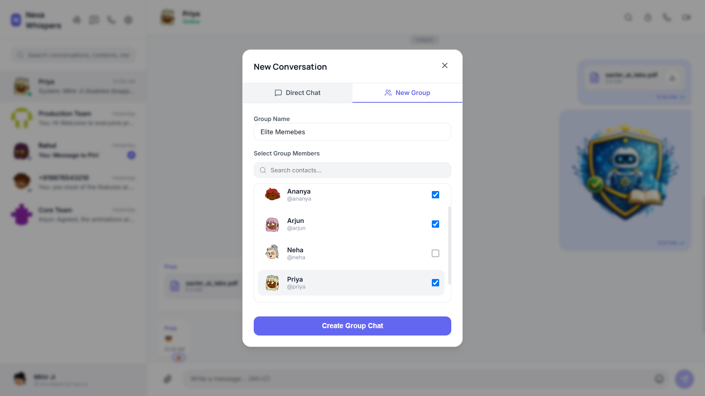

</td>
<td width="50%" align="center">

### 🛡️ Admin Group Controls

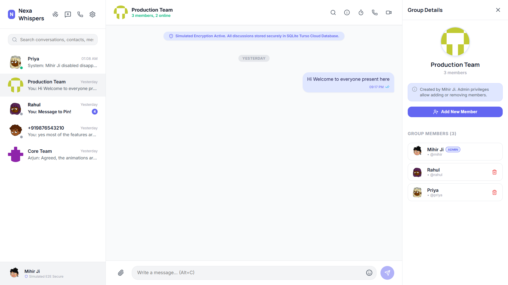

</td>
</tr>

<tr>
<td width="50%" align="center">

### 🔒 Privacy Section

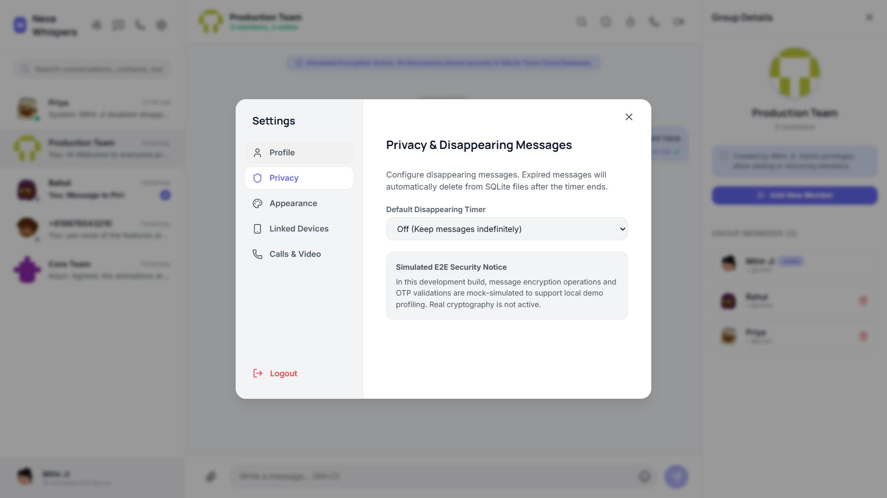

</td>
<td width="50%" align="center">

### 🎨 Theme Toggle

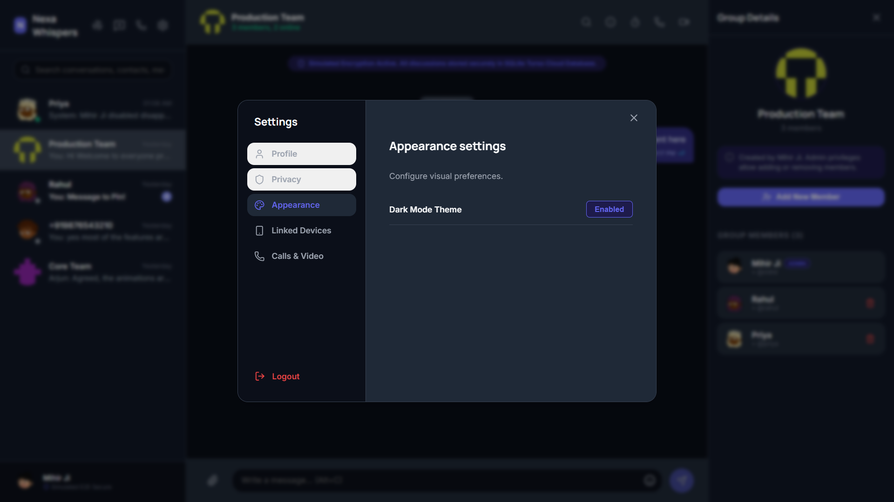

</td>
</tr>

<tr>
<td width="50%" align="center">

### 💻 Linked Devices

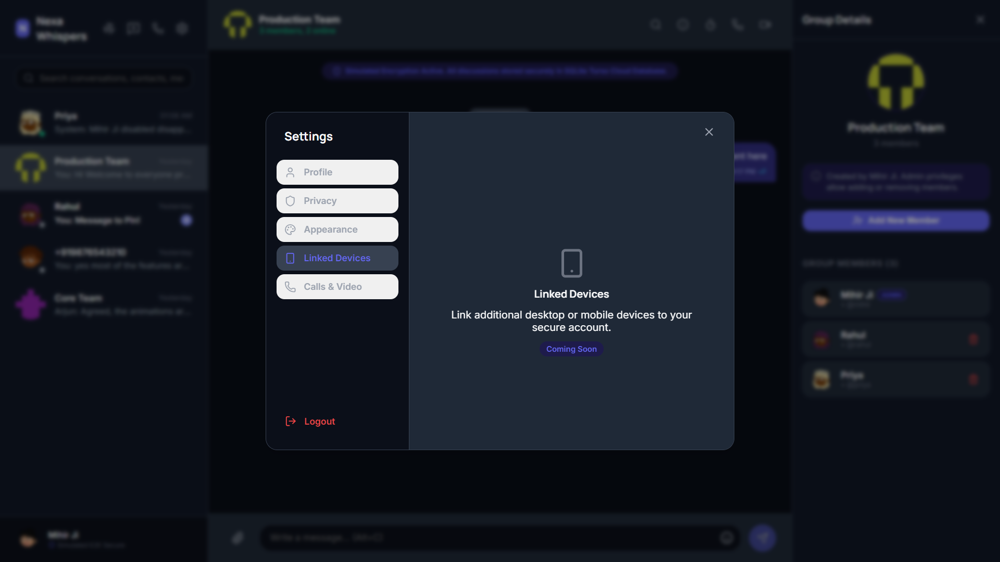

</td>
<td width="50%" align="center">

### 🌙 Night Mode Conversation

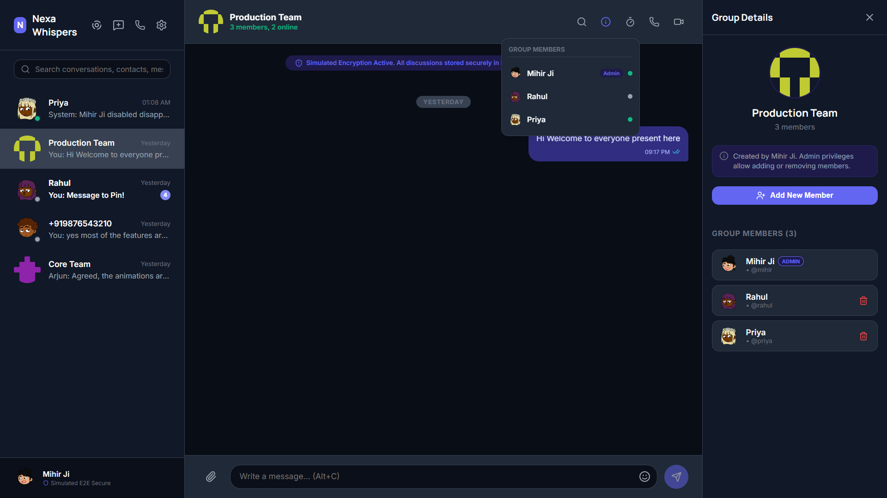

</td>
</tr>

<tr>
<td width="50%" align="center">

### ↩️ Reply & Delete Messages

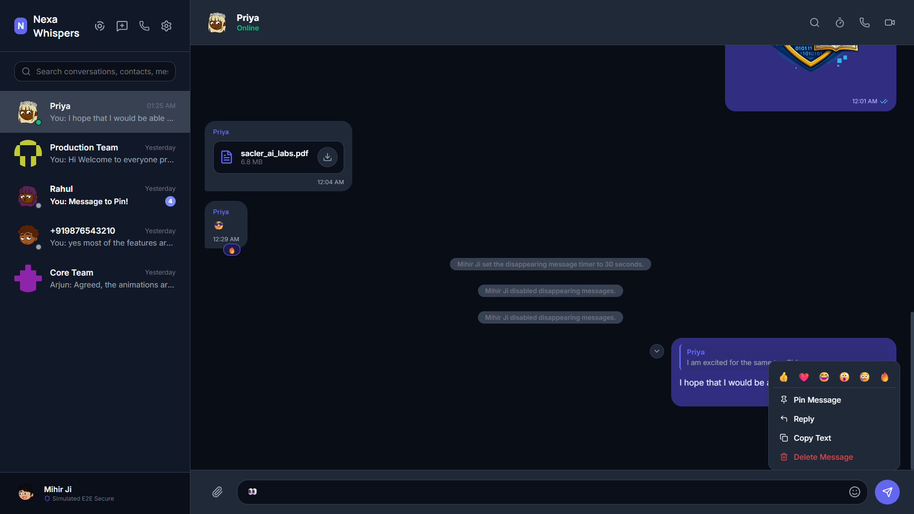

</td>
<td width="50%" align="center">

### 📱 Responsive Smartphone Experience

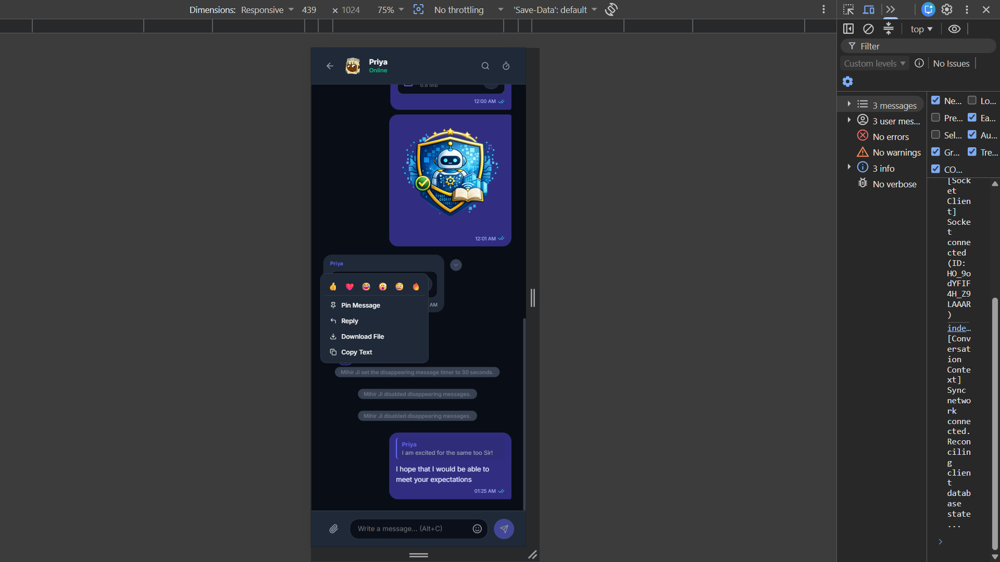

</td>
</tr>
</table>

---

# ✨ Key Features

### ⚡ Real-Time Messaging

* Instant message delivery using Socket.IO
* Multi-client conversation synchronization
* Real-time message updates
* Online/offline presence
* Typing indicators
* Delivery and read receipt synchronization

### ✓ Message Status

Messages follow a synchronized lifecycle:

```text
Sent → Delivered → Read
```

Status changes are propagated between connected clients through WebSocket events.

### ⌨️ Typing Indicators

Real-time typing events dynamically display when another participant is composing a message.

```text
Priya is typing...
```

### ⏳ Disappearing Messages

Messages can automatically expire after configured durations such as:

* 5 seconds
* 1 minute
* 1 day

Expired messages are handled through the application's cleanup workflow.

### 👥 Direct & Group Conversations

Supports both one-to-one conversations and multi-member groups.

Group administrators can:

* Add members
* Remove members
* Manage membership
* Synchronize changes in real time

### 👤 Contact Information

The contact sidebar provides:

* Profile avatar
* Display name
* Online status
* Username
* Phone number
* About/Bio
* Mutual groups
* Contact actions

### 🔗 Mutual Groups

Users can view groups shared with a contact and navigate directly to those conversations.

### 🚫 Contact Blocking

Users can block contacts directly from the conversation information panel.

Blocking immediately restricts further messaging.

### ⚠️ Contact Reporting

A reporting workflow allows users to report contacts for administrative review.

### 🔐 Authentication

The authentication system includes:

* User registration
* OTP verification
* Login/logout
* JWT authentication
* HttpOnly cookies
* BcryptJS password hashing
* Protected API routes

### 👤 Profile Management

Users can manage:

* Display name
* Username
* Avatar
* About/Bio

### 🌙 Theme Support

The application includes light and dark visual modes with responsive UI components and smooth transitions.

### 📱 Responsive Experience

The interface adapts across desktop, tablet, and smartphone layouts while maintaining the core messaging experience.

---

# 🏛️ System Architecture

Nexa Whispers uses a **layered client-server architecture** combining REST APIs for persistent operations with WebSockets for real-time communication.

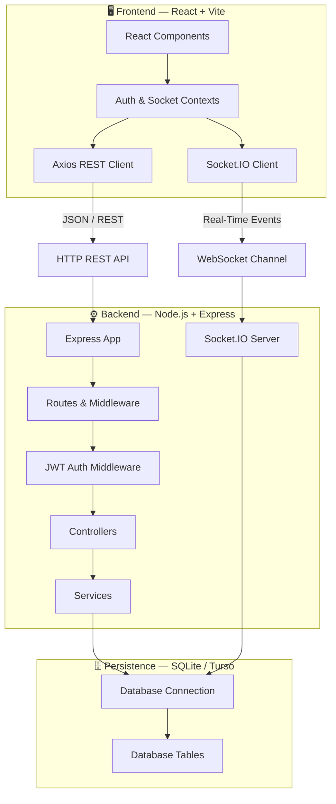

---

# 🔄 Application Data Flow

## REST API Flow

```text
React Component
      ↓
Context / Hook
      ↓
Axios
      ↓
Express Route
      ↓
JWT Middleware
      ↓
Controller
      ↓
Service
      ↓
SQLite
      ↓
JSON Response
      ↓
React State
```

## Real-Time Flow

```text
User Action
     ↓
Socket.IO Client
     ↓
Socket.IO Server
     ↓
Event Handler
     ↓
Database / Application State
     ↓
Broadcast Event
     ↓
Connected Clients
     ↓
UI Update
```

The architecture keeps traditional API operations structured while allowing time-sensitive interactions to happen instantly through WebSockets.

---

# 🛠️ Technology Stack

| Layer               | Technology        | Purpose                   |
| :------------------ | :---------------- | :------------------------ |
| **Frontend**        | React 19          | Component-based SPA       |
| **Build Tool**      | Vite              | Fast development & builds |
| **Routing**         | React Router 7    | Client-side navigation    |
| **State**           | React Context API | Global application state  |
| **HTTP**            | Axios             | REST API communication    |
| **Real-Time**       | Socket.IO         | WebSocket communication   |
| **Backend**         | Node.js           | Server runtime            |
| **API**             | Express.js        | REST API framework        |
| **Authentication**  | JWT               | Session authentication    |
| **Security**        | BcryptJS          | Password hashing          |
| **Database**        | SQLite            | Relational persistence    |
| **Cloud Database**  | Turso             | Cloud SQLite option       |
| **Drivers**         | sqlite3 / sqlite  | Database connectivity     |
| **Styling**         | Vanilla CSS       | Responsive UI             |
| **Typography**      | Inter / Outfit    | Application typography    |
| **Deployment**      | Vercel + Render   | Hosting                   |
| **Version Control** | Git + GitHub      | Source control            |

---

# 📂 Project Structure

```text
NEXA-WHISPERS/
│
├── 📁 assets/
│   ├── 📁 screenshots/
│   │   ├── 1_Landing_Page.png
│   │   ├── 2_Sign_Up_Page.png
│   │   ├── 3_OTP_Verification.png
│   │   ├── 4_Conversation_Page.png
│   │   ├── 5_Contact_Info_Page.png
│   │   ├── 6_Disappearing_Timer_Reply_Dialog.png
│   │   ├── 7_Stories_Section.png
│   │   ├── 8_Add_Contacts.png
│   │   ├── 9_New_Group_Creation.png
│   │   ├── 10_Admin_Group_Control.png
│   │   ├── 11_Privacy_Section.png
│   │   ├── 12_Theme_Toggle.png
│   │   ├── 13_Mock_Linked_Devices.png
│   │   ├── 14_Night_Mode_Conversation.png
│   │   ├── 15_Reply_Delete_Messages.png
│   │   └── 16_Responsive_For_SmartPhones.png
│   │
│   ├── HeaderSection.png
│   ├── gif.gif
│   └── Video.mp4
│
├── 📁 backend/
│   ├── 📁 database/
│   │   └── database.db
│   │
│   ├── 📁 src/
│   │   ├── 📁 controllers/
│   │   ├── 📁 database/
│   │   ├── 📁 middleware/
│   │   ├── 📁 routes/
│   │   ├── 📁 services/
│   │   ├── 📁 sockets/
│   │   └── app.js
│   │
│   ├── package.json
│   └── server.js
│
├── 📁 frontend/
│   ├── 📁 src/
│   │   ├── 📁 assets/
│   │   ├── 📁 components/
│   │   ├── 📁 context/
│   │   ├── 📁 pages/
│   │   └── main.jsx
│   │
│   ├── package.json
│   └── vite.config.js
│
├── .gitignore
├── favicon.svg
├── package.json
└── README.md
```

### Backend Responsibilities

| Directory      | Responsibility                          |
| :------------- | :-------------------------------------- |
| `controllers/` | Request handling & business validation  |
| `database/`    | Schema initialization & seeders         |
| `middleware/`  | Authentication & error handling         |
| `routes/`      | REST endpoint definitions               |
| `services/`    | Database operations & business services |
| `sockets/`     | Real-time event handling                |
| `server.js`    | Backend entry point                     |

### Frontend Responsibilities

| Directory     | Responsibility                |
| :------------ | :---------------------------- |
| `components/` | Reusable UI components        |
| `context/`    | Global React state            |
| `pages/`      | Application screens           |
| `assets/`     | Static UI resources           |
| `main.jsx`    | React application entry point |

---

# 📡 REST API

## 🔐 Authentication

| Method | Endpoint               | Description                 |
| :----: | :--------------------- | :-------------------------- |
| `POST` | `/api/auth/register`   | Create user                 |
| `POST` | `/api/auth/verify-otp` | Verify OTP                  |
| `POST` | `/api/auth/login`      | Authenticate user           |
| `POST` | `/api/auth/logout`     | Clear authentication cookie |
|  `GET` | `/api/auth/me`         | Retrieve active session     |

## 👤 Users & Profiles

| Method | Endpoint                  | Description      |
| :----: | :------------------------ | :--------------- |
|  `GET` | `/api/users/profile/:id?` | Retrieve profile |
|  `PUT` | `/api/users/profile`      | Update profile   |
| `POST` | `/api/users/block`        | Block contact    |
| `POST` | `/api/users/unblock`      | Unblock contact  |
| `POST` | `/api/users/report`       | Submit report    |

## 💬 Conversations

|  Method  | Endpoint                                 | Description                 |
| :------: | :--------------------------------------- | :-------------------------- |
|   `GET`  | `/api/conversations`                     | Retrieve conversations      |
|  `POST`  | `/api/conversations/direct`              | Create/retrieve direct chat |
|  `POST`  | `/api/conversations/group`               | Create group                |
|   `GET`  | `/api/conversations/:id/messages`        | Retrieve messages           |
|  `POST`  | `/api/conversations/:id/messages`        | Send message/attachment     |
|  `POST`  | `/api/conversations/:id/members`         | Add group member            |
| `DELETE` | `/api/conversations/:id/members/:userId` | Remove member               |

---

# 🔌 WebSocket Events

Socket.IO powers the application's real-time communication layer.

| Event                  | Direction       | Purpose                        |
| :--------------------- | :-------------- | :----------------------------- |
| `message:new`          | Server → Client | Broadcast new message          |
| `message:status`       | Both            | Sync sent/delivered/read state |
| `typing:start`         | Both            | Start typing indicator         |
| `typing:stop`          | Both            | Stop typing indicator          |
| `group:member-added`   | Server → Client | Sync added member              |
| `group:member-removed` | Server → Client | Sync removed member            |
| `user:online`          | Server → Client | Broadcast online status        |
| `user:offline`         | Server → Client | Broadcast offline/last seen    |

---

# 🔐 Security & Privacy

Nexa Whispers incorporates several security-focused mechanisms:

* JWT-based authentication
* HttpOnly authentication cookies
* Protected backend routes
* BcryptJS password hashing
* Authentication middleware
* Contact blocking
* Reporting workflow
* Disappearing messages
* Privacy settings
* Session-aware API operations

### Important Privacy Disclaimer

Nexa Whispers provides a **privacy-focused user experience**, but it does **not currently implement the Signal Protocol or production-grade cryptographic end-to-end encryption**.

The encryption indicators shown within the application are simulated for the project experience.

A production messaging system would require formally reviewed cryptographic protocols, secure key exchange, device verification, and robust key management.

---

# 🗄️ Database & Persistence

The application uses SQLite for relational data persistence and can integrate with Turso for cloud-hosted SQLite.

```text
Application
     ↓
Database Service
     ↓
SQLite Driver
     ↓
SQLite / Turso
```

Persistent data includes:

* Users
* Profiles
* Conversations
* Messages
* Group memberships
* Message statuses
* Blocking relationships
* Application metadata

---

# 🚀 Local Development

## Prerequisites

* Node.js 18+
* npm
* Git

## 1. Clone

```bash
git clone https://github.com/mihirgupta665/NEXA-WHISPERS.git
cd NEXA-WHISPERS
```

## 2. Backend

```bash
cd backend
npm install
cp .env.example .env
npm run db:init
npm run db:seed
npm run dev
```

Backend:

```text
http://localhost:5001
```

## 3. Frontend

Open another terminal:

```bash
cd frontend
npm install
npm run dev
```

Frontend:

```text
http://localhost:5173
```

---

# 👥 Demo Profiles

Seeded profiles are available for testing real-time communication across multiple browser sessions.

```text
Users:
mihir
rahul
ananya
arjun
priya
neha
```

### Development Credentials

```text
Password: password123
OTP:      123456
```

> These credentials are intended only for local development and demonstration.

---

# ☁️ Production Deployment

Nexa Whispers uses a split deployment architecture:

```text
                    GitHub
                       │
              ┌────────┴────────┐
              │                 │
              ▼                 ▼
           Vercel             Render
              │                 │
              ▼                 ▼
        React + Vite       Node + Express
                                │
                                ▼
                           Socket.IO
                                │
                                ▼
                         SQLite / Turso
```

### Frontend

Hosted on **Vercel**.

### Backend

Hosted on **Render** as a Node.js service.

### Database

SQLite/Turso provides the persistence layer depending on deployment configuration.

---

# 💾 SQLite Persistence on Render

SQLite databases stored on an ephemeral container filesystem can be lost during redeployments.

For persistent SQLite storage on Render:

1. Create a Render Persistent Disk.
2. Mount it at a path such as:

```text
/var/data
```

3. Configure:

```env
DATABASE_PATH=/var/data/database.db
```

The backend should use this environment variable when establishing its SQLite connection.

This keeps the database file on persistent storage instead of the temporary deployment filesystem.

---

# 🧠 Engineering Highlights

### 01 — Real-Time Architecture

Socket.IO handles:

```text
Messages
Typing
Presence
Read Receipts
Group Membership
```

### 02 — REST + WebSocket Hybrid

REST handles structured persistent operations while Socket.IO handles time-sensitive state changes.

### 03 — Layered Backend

```text
Routes
  ↓
Middleware
  ↓
Controllers
  ↓
Services
  ↓
Database
```

This separation keeps responsibilities modular and easier to maintain.

### 04 — Persistent Conversations

Messages and user information are stored in the database instead of relying entirely on browser state.

### 05 — Responsive UI

The interface is designed for:

```text
Desktop → Laptop → Tablet → Smartphone
```

---

# 🛣️ Future Roadmap

### 🔐 Privacy

* [ ] Signal Protocol / true end-to-end encryption
* [ ] Secure key exchange
* [ ] Device verification
* [ ] Encrypted local storage

### 📞 Communication

* [ ] Voice calling
* [ ] Video calling
* [ ] Voice messages
* [ ] Screen sharing

### 💬 Messaging

* [ ] Message reactions
* [ ] Pinned messages
* [ ] Starred messages
* [ ] Advanced message search
* [ ] Media gallery
* [ ] Message forwarding

### 📱 Platform

* [ ] Push notifications
* [ ] Progressive Web App
* [ ] Native mobile applications
* [ ] Multi-device synchronization
* [ ] Passkey authentication

---

# 🎯 What Nexa Whispers Demonstrates

This project brings together:

* React component architecture
* REST API development
* WebSocket communication
* Real-time state synchronization
* JWT authentication
* Password security
* SQL database design
* Backend service architecture
* Responsive UI engineering
* Production deployment
* Persistent cloud hosting
* Full-stack debugging

---

# 🌐 Project Links

| Resource                 | Link                                                            |
| :----------------------- | :-------------------------------------------------------------- |
| 🚀 **Live Application**  | [nexa-whispers.vercel.app](https://nexa-whispers.vercel.app/)   |
| 💻 **GitHub Repository** | [NEXA-WHISPERS](https://github.com/mihirgupta665/NEXA-WHISPERS) |
| 🎬 **Walkthrough Video** | [`assets/Video.mp4`](assets/Video.mp4)                          |

---

<p align="center">

## 💜 Nexa Whispers

### **Speak Freely. Stay Private.**

**Built with React • Node.js • Socket.IO • SQLite**

</p>

<p align="center">
  <sub>Designed, engineered, and deployed as a complete full-stack real-time messaging platform.</sub>
</p>
