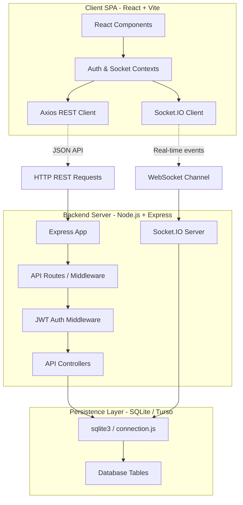

# Nexa Whispers 💬

Nexa Whispers is a polished, privacy-focused, real-time messaging application. Built with a modern **React SPA (Vite)** frontend, a robust **Node.js/Express REST API**, and a real-time event-driven **Socket.IO** server, it delivers a secure, premium chat experience backed by a persistent **SQLite/Turso** database layer.

---

## 🏛️ System Architecture

Nexa Whispers uses a client-server architecture split into a high-performance Single Page Application (SPA) frontend and a dual REST/WebSocket backend server.



---

## ✨ Core Capabilities

### ⚡ Real-Time Instant Messaging
- **Real-Time Communication**: Multi-client chat propagation backed by Socket.IO.
- **Receipt Syncing**: Instant `sent` ➜ `delivered` ➜ `read` status syncs across sender and receiver windows.
- **Typing Indicators**: Visual indicators dynamically reflecting typing statuses of users.
- **Disappearing Messages**: End-to-end simulated messaging timers (e.g. 5s, 1m, 1d) that perform lazy-cleanups of expired conversations inside SQLite.

### 👥 Interactive Profiles & Sidebars
- **Details Sidebar**: Click on any chat header to slide open an elegant sidebar displaying contact statuses, username metadata, mutual groups, phone numbers, and actions.
- **Mutual Groups**: Displays shared group spaces in common. Click to navigate directly to the shared conversation.
- **Real blocking**: Block users instantly in direct chats. Blocking halts messaging immediately, rendering error warnings in inputs.
- **Simulation Reports**: Simulates reporting contacts for administrative review.

### 🛡️ Group Administration
- **Sleek Admin Controls**: Group creators/admins can add new members by searching through added contacts, or remove members from the group space dynamically.
- **Live Membership Sync**: Addition or removal of members is broadcasted instantly via WebSocket to redraw group components.

### ⚙️ User Privacy & Profile Management
- **Personalized About Section**: Configure and edit your bio from the Settings modal, which is persisted globally and viewable to your chat contacts.

---

## 🛠️ Technology Stack

| Layer | Technologies | Key Capabilities |
| :--- | :--- | :--- |
| **Frontend** | React 19, Vite, React Router 7 | Responsive SPA rendering, light/dark mode theme triggers, context-driven state management |
| **Realtime** | Socket.IO Client & Server | Bi-directional client-server state events, typing indicator tracking, instant receipt broadcasts |
| **Backend** | Node.js, Express, JWT, BcryptJS | REST API routing, secure HttpOnly cookie session auth, schema validator middlewares |
| **Database** | SQLite, SQLite3, sqlite (driver) | Relational SQL persistence, schema migrations, binary BLOB storage for document attachments |
| **Styling** | Vanilla CSS Grid & Flexbox | Modern typography (Inter, Outfit), high-performance animation tokens, glassmorphism UI |

---

## 📂 Project Structure

```text
NEXA-WHISPERS/
├── backend/
│   ├── database/
│   │   └── database.db          # Persistent SQLite database file
│   ├── src/
│   │   ├── controllers/         # Handles route responses & business validation
│   │   ├── database/            # Schema tables initialization and seeder code
│   │   ├── middleware/          # JWT check cookies, error handling wrappers
│   │   ├── routes/              # Express API route registrations
│   │   ├── services/            # Database transactions & services
│   │   ├── sockets/             # Real-time WebSocket event configurations
│   │   └── app.js               # Express application initialization
│   ├── package.json
│   └── server.js                # Core entry point starting REST and WS servers
├── frontend/
│   ├── src/
│   │   ├── assets/              # Static SVG images and styles
│   │   ├── components/          # Reusable layouts, modals, and composition tools
│   │   ├── context/             # Global React hooks (Auth, Conversations, Sockets)
│   │   ├── pages/               # Main view ports (Login, Register, Chat workspace)
│   │   └── main.jsx             # React client entry point
│   ├── package.json
│   └── vite.config.js
└── package.json
```

---

## 📡 API and WebSocket Documentation

### REST API Endpoints

#### Authentication
- `POST /api/auth/register` - Create new user profile.
- `POST /api/auth/verify-otp` - Verify 6-digit verification code (`123456` in development).
- `POST /api/auth/login` - Initiate user sign-in session.
- `POST /api/auth/logout` - Clear JWT authentication cookie.
- `GET /api/auth/me` - Retrieve active user session metadata.

#### User Profile
- `GET /api/users/profile/:id?` - Fetch profile metadata, including bio status (`about`), mutual groups, and blocking relations.
- `PUT /api/users/profile` - Update display name, avatar, username, and bio status.
- `POST /api/users/block` - Block contact messaging.
- `POST /api/users/unblock` - Remove contact block.
- `POST /api/users/report` - Submit Simulation Abuse Report.

#### Conversations & Messaging
- `GET /api/conversations` - Fetch list of active direct and group chats.
- `POST /api/conversations/direct` - Retrieve or establish a direct 1-to-1 chat space.
- `POST /api/conversations/group` - Establish a new group space with specified member list.
- `GET /api/conversations/:id/messages` - Retrieve chat message history.
- `POST /api/conversations/:id/messages` - Send a text message or file attachment.
- `POST /api/conversations/:id/members` - Add contact to group (Admin only).
- `DELETE /api/conversations/:id/members/:userId` - Remove member from group (Admin only).

---

### Real-Time WebSocket Event Specs

| Event | Direction | Payload | Description |
| :--- | :--- | :--- | :--- |
| `message:new` | Server ➜ Client | `Message` | Broadcasts new message text/attachment to conversation members |
| `message:status` | Both | `{ messageId, status }` | Propagates message status changes (`sent` ➜ `delivered` ➜ `read`) |
| `typing:start` | Both | `{ conversationId, username }` | Triggers "Typing..." notification in client headers |
| `typing:stop` | Both | `{ conversationId, userId }` | Clears active typing text from recipient client header |
| `group:member-added` | Server ➜ Client | `{ conversation, targetUserId }` | Propagates new group members to update UI lists |
| `group:member-removed` | Server ➜ Client | `{ conversationId, targetUserId }` | Triggers conversation exit or members list updates |
| `user:online` | Server ➜ Client | `{ userId }` | Broadcasts user connection presence status |
| `user:offline` | Server ➜ Client | `{ userId, last_seen }` | Broadcasts user disconnection and last seen timestamp |

---

## 🚀 Installation & Local Execution

### Prerequisites
- **Node.js** v18 or newer
- **npm** package manager

### 1. Launch the Backend Server
```bash
# Navigate to the backend directory
cd backend

# Install dependencies
npm install

# Set up configuration variables
cp .env.example .env

# Initialize database schema tables
npm run db:init

# Seed database with dummy developer data profiles
npm run db:seed

# Start node development watcher
npm run dev
```
*Note: The API server runs at `http://localhost:5001`.*

### 2. Launch the Frontend React Client
```bash
# Navigate to the frontend directory
cd ../frontend

# Install dependencies
npm install

# Start Vite SPA hot reloader
npm run dev
```
*Note: Open `http://localhost:5173/` in your browser to access the application.*

---

## 👥 Demo Profiles

Use the seeded profiles below to test real-time features across multiple browser profiles (e.g. Standard Chrome Window and Incognito window):

* **Available Users**: `mihir`, `rahul`, `ananya`, `arjun`, `priya`, `neha`
* **Default Password**: `password123`
* **Local Developer OTP**: `123456`

---

## 🗄️ Database Production Persistence (Render)

SQLite databases are stored as local files. When deploying to container-based hosts like Render, any write operations inside the container are lost during redeployments. 

To achieve persistent data storage in production:
1. Set up a **Persistent Disk** on Render (e.g., Mount Path `/var/data`).
2. Add the following environment variable to the Render Web Service configuration:
   ```env
   DATABASE_PATH=/var/data/database.db
   ```
This redirects connection streams to the persistent disk path, maintaining active chat data safely across node upgrades and service builds.
